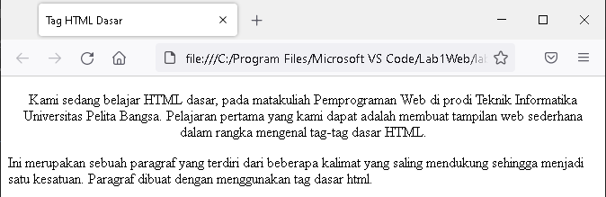
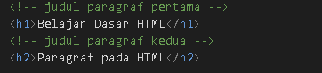
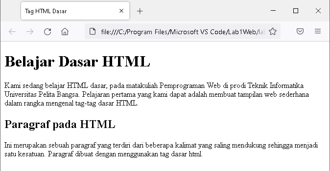

# Lab1Web
## Belajar dasar HTML
## modul Praktikum Pemprograman Web
### Membuat Heading
kode tag untuk heading adalah '
'
 
lalu refresh browser, dan ini adalah tampilannya '
'
 
### 1.Membuat Paragraf 
kode tag untuk paragraf adalah '
'
   
Selanjutnya simpan kembali perubahannya, dan lakukan refresh pada browser, lihat hasilnya.
 '
'
 
 Kemudian atur atribut paragraf seperti berikut '
'
 
simpan kembali,dan refresh pada browser.Dan ini hasil perubahannya '
'
 
### 2.Menambahkan Judul
Kode tag untuk Judul adalah '
'
 
Simpan perubahan kemudian refresh pada browser.Dan ini hasil nya'
'
 
### 3. Memformat teks
 Pemformatan tekt pada paragraf.
 
