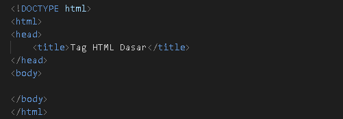
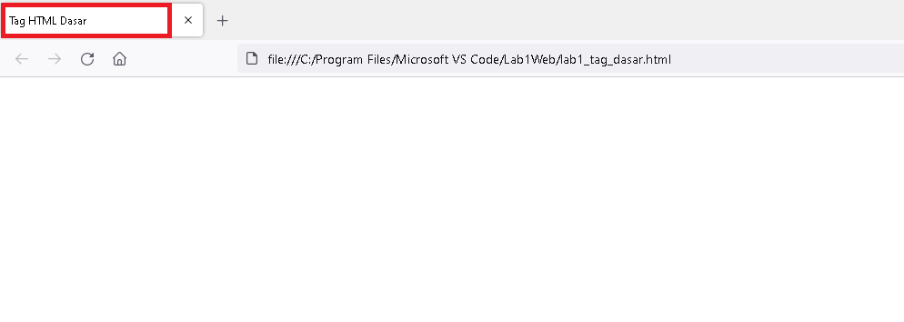
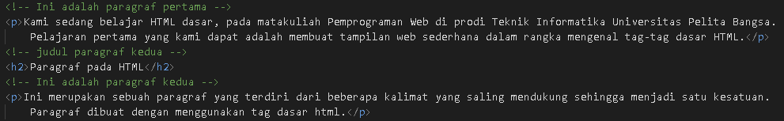

# Lab1Web
## Belajar dasar HTML
## modul Praktikum Pemprograman Web
### Membuat Heading
kode tag untuk heading adalah 

  
lalu refresh browser, dan ini adalah tampilannya 

  
### 1.membuat Paragraf 
kode tag untuk paragraf adalah 

    
ini adalah tampilannya 

  
