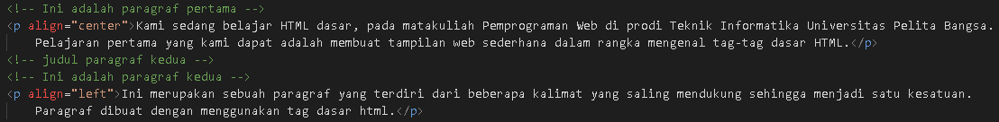

# Lab1Web
## Belajar dasar HTML
## modul Praktikum Pemprograman Web
### Membuat Heading
kode tag untuk heading adalah '
'

lalu refresh browser, dan ini adalah tampilannya '
'

### 1.membuat Paragraf 
kode tag untuk paragraf adalah '
'
  
Selanjutnya simpan kembali perubahannya, dan lakukan refresh pada web browser, lihat hasilnya.
 '
'

 Kemudian atur atribut paragraf seperti berikut '
'

