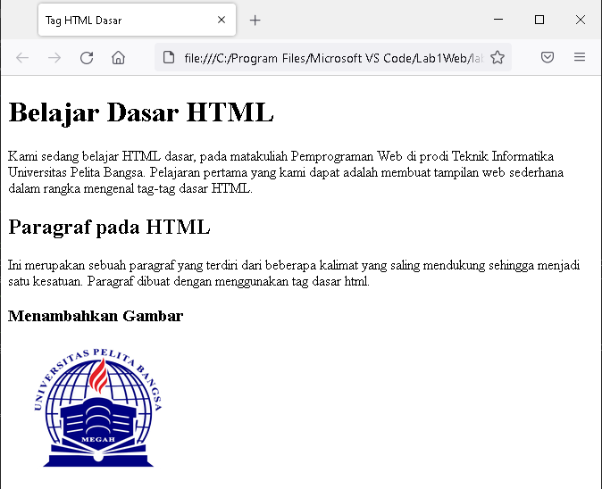
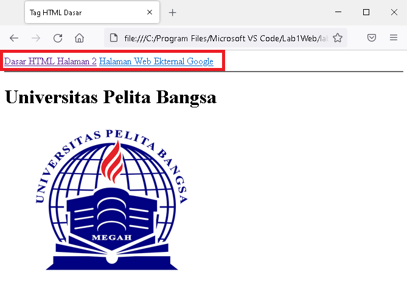

# Lab1Web
## Belajar dasar HTML
## Modul Praktikum Pemprograman Web

 '
'
 Kemudian buka file tersebut pada browser, dan ini adalah tampilannya.'
'
 '
'
### 1.Membuat Paragraf 
kode tag untuk paragraf adalah '
'
 '
'
Selanjutnya simpan kembali perubahannya, dan lakukan refresh pada browser, lihat hasilnya.'
'
 '
'
 Kemudian atur atribut paragraf seperti berikut'
'
 '
'
simpan kembali,dan refresh pada browser.Dan ini hasil perubahannya'
'
 '
'
### 2.Menambahkan Judul'
'
Kode tag untuk Judul adalah'
'
 '
'
Simpan perubahan kemudian refresh pada browser.Dan ini hasil nya'
'
 '
'
### 3.Memformat teks'
'
Pemformatan tekt pada paragraf'
'
 '
'
### 4.Menyisipkan Gambar'
'
Siapkan gambar yang akan disisipkan pada web,dan kode tag untuk gambar adalah.'
'
 '
'
Simpan perubahan lalu refresh browser.Dan ini hasil nya.'
'
 '
'
Gambar akan ditampilkan dengan apa adanya sesuai ukuran aslinya.Dan kode tag untuk mengatur ukuran gambar.'
'
 '
'
### 5.Menambahkan Hyperlink'
'
Tambahkan hyperlink pada dokumen sebelum heading 1 seperti berikut.'
'
 '
'
Buat satu file lagi dengan nama lab1_halaman2.html lalu isi dengan tag html dasar.Ini hasilnya.'
'
 '
'
